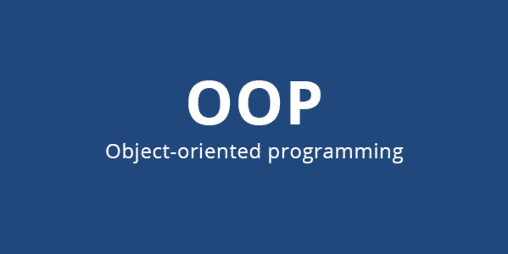
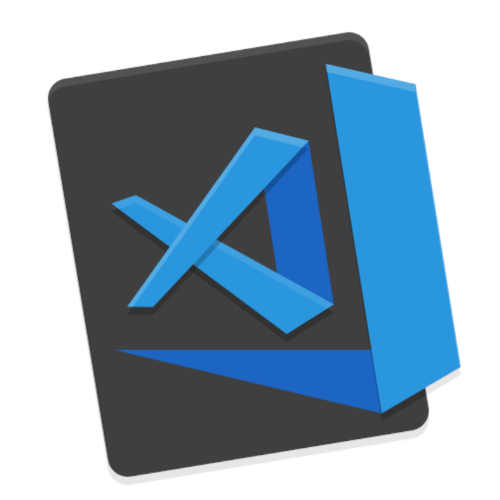

<!DOCTYPE html>
<html lang="pt-br">

<head>
    <meta charset="UTF-8">
    <meta name="viewport" content="width=device-width, initial-scale=1.0">

</head>

<body>
    <h1>Plataforma_EAD</h1>
    

        Sistema este onde o aluno, pode acessar os seus cursos e assitir suas aulas, conforme o cadastramento em sistema
    

    <h3>Ferramentas que foram utilizadas para desenvolver o projeto foram: </h3>
     
    

        <h3>Ferramentas Utilizadas em front-end</h3>
        

        <ul>
             &nbsp;
            <strong style='text-align:justify;'>&nbsp;HTML 5 </strong> 
             
            &nbsp;
            <strong style='text-align:justify;'>&nbsp;CSS 3 
                 
                &nbsp;<strong
                    style='text-align:justify;'>&nbsp;JS </strong> 
                 
        </ul>
    

    

        <h3>Linguagem feita em seu Backend </h3>
        

         
        <ul>
            &nbsp;<strong style='text-align:justify;'> &nbsp;PHP na
                versão
                7.4 </strong> 
        </ul>
    

    

        <h3>Servidor Utilizado </h3>
        

         
        <ul>
             &nbsp;<strong
                style='text-align:justify'>&nbsp;Xampp</strong> 
        </ul>
    

    

        <h3>Banco de dados </h3>
        

         
        <ul>
             &nbsp;<strong
                style='text-align:justify;'>&nbsp;MYSQL</strong> 
        </ul>
    

    

        <h3>Softwares e utilitários </h3>
        

         
        <ul>
            
            &nbsp;<strong style='text-align:justify;'>&nbsp;Mysql Workbench </strong> 
             
             &nbsp;<strong
                style='text-align:justify;'>&nbsp; PHPMYADMIN </strong> 
             
        </ul>
         
    

    

        <h3>Bibliotecas PHP para configuração do projeto </h3>
        

         
        <ul>
             &nbsp;<strong
                style='text-align:justify;'>&nbsp;PDO</strong> 
             
             &nbsp;<strong
                style='text-align:justify;'>&nbsp;POO</strong> 
             
        </ul>
         
    

    

        <h3>Arquitetura </h3>
        

         
        <ul>
             &nbsp;<strong
                style='text-align:justify;'>&nbsp; MVC </strong> 
        </ul>
    

     
    

        <h3>Editor de código </h3>
        

         
        <ul>
             &nbsp;<strong
                style='text-align:justify;'>&nbsp; Visual Studio Code </strong> 
        </ul>
    

</body>

</html>